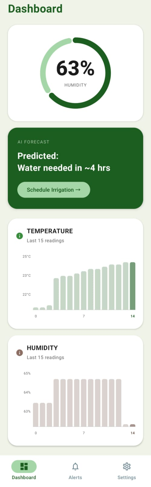
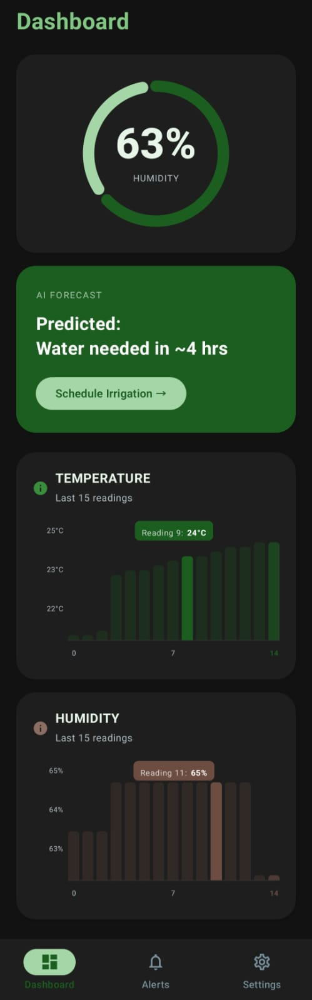
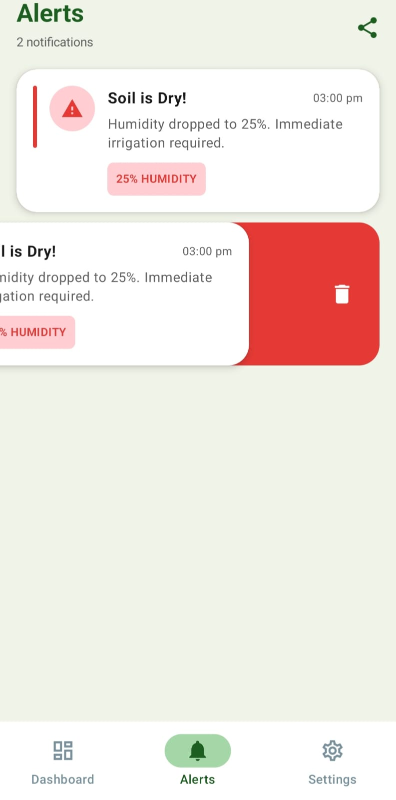
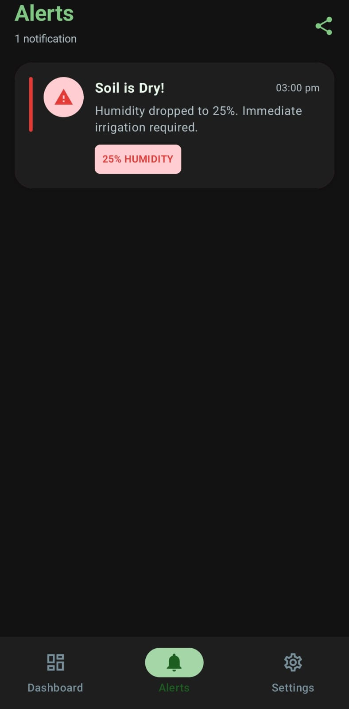
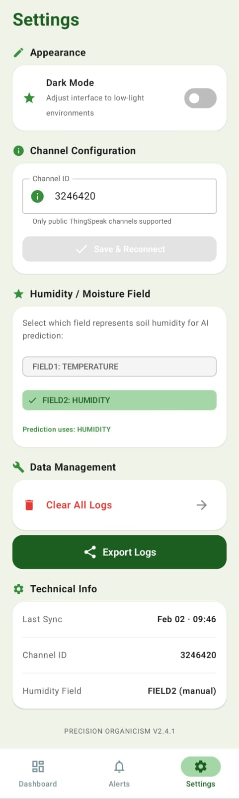
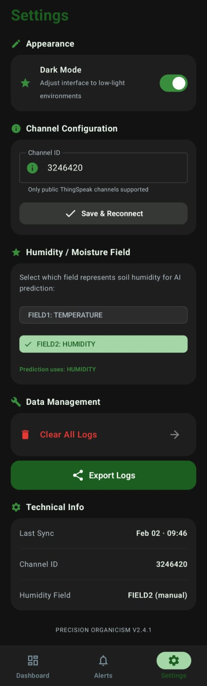
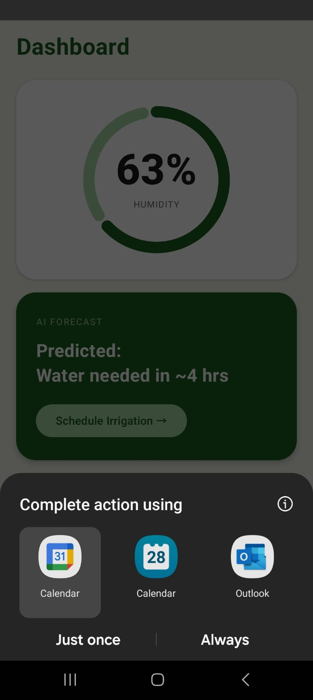
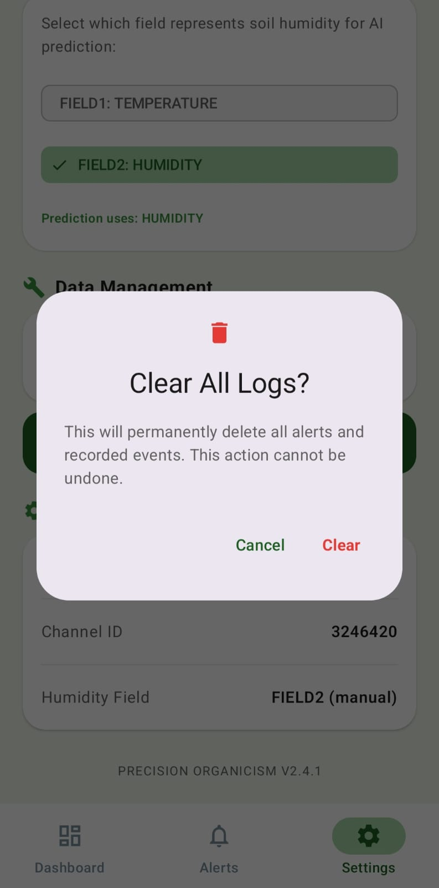

# Calyx

A native Android application for smart irrigation and crop monitoring. Calyx connects to a public ThingSpeak IoT channel, fetches live sensor data every 20 seconds, runs a linear regression model to predict when soil will need water, and alerts you before it becomes a problem.

Built with Kotlin and Jetpack Compose.

---

## Screenshots

<table align="center">
  <tr>
    <td align="center"></td>
    <td align="center"></td>
    <td align="center"></td>
    <td align="center"></td>
  </tr>
  <tr>
    <td align="center"><sub>Dashboard (Light)</sub></td>
    <td align="center"><sub>Dashboard (Dark)</sub></td>
    <td align="center"><sub>Alerts (Light)</sub></td>
    <td align="center"><sub>Alerts (Dark)</sub></td>
  </tr>
  <tr>
    <td align="center"></td>
    <td align="center"></td>
    <td align="center"></td>
    <td align="center"></td>
  </tr>
  <tr>
    <td align="center"><sub>Settings (Light)</sub></td>
    <td align="center"><sub>Settings (Dark)</sub></td>
    <td align="center"><sub>Schedule Irrigation</sub></td>
    <td align="center"><sub>Clear Logs</sub></td>
  </tr>
</table>


<table align="center">
  <tr>
    <td align="center"></td>
    <td align="center"></td>
  </tr>
  <tr>
    <td align="center"><sub>Dashboard (Light)</sub></td>
    <td align="center"><sub>Dashboard (Dark)</sub></td>
  </tr>
  <tr>
    <td align="center"></td>
    <td align="center"></td>
  </tr>
  <tr>
    <td align="center"><sub>Alerts (Light)</sub></td>
    <td align="center"><sub>Alerts (Dark)</sub></td>
  </tr>
  <tr>
    <td align="center"></td>
    <td align="center"></td>
  </tr>
  <tr>
    <td align="center"><sub>Settings (Light)</sub></td>
    <td align="center"><sub>Settings (Dark)</sub></td>
  </tr>
  <tr>
    <td align="center"></td>
    <td align="center"></td>
  </tr>
  <tr>
    <td align="center"><sub>Schedule Irrigation</sub></td>
    <td align="center"><sub>Clear Logs</sub></td>
  </tr>
</table>

<p align="center">
  
  &nbsp;
  
  &nbsp;
  
  &nbsp;
  
  &nbsp;
  
  &nbsp;
  
  &nbsp;
  
  &nbsp;
  
</p>
<p align="center">
  <sub>Dashboard (Light) &nbsp;&nbsp;&nbsp; Dashboard (Dark) &nbsp;&nbsp;&nbsp; Alerts &nbsp;&nbsp;&nbsp; Settings</sub>
</p>


### Dashboard

<p align="center">
  
  &nbsp;&nbsp;&nbsp;&nbsp;
  
</p>
<p align="center">
  <sub>Light Mode &nbsp;&nbsp;&nbsp;&nbsp;&nbsp;&nbsp;&nbsp;&nbsp;&nbsp;&nbsp;&nbsp;&nbsp;&nbsp;&nbsp;&nbsp;&nbsp;&nbsp;&nbsp;&nbsp;&nbsp;&nbsp;&nbsp;&nbsp;&nbsp; Dark Mode</sub>
</p>

---

### Alerts

<p align="center">
  
  &nbsp;&nbsp;&nbsp;&nbsp;
  
</p>
<p align="center">
  <sub>Light Mode &nbsp;&nbsp;&nbsp;&nbsp;&nbsp;&nbsp;&nbsp;&nbsp;&nbsp;&nbsp;&nbsp;&nbsp;&nbsp;&nbsp;&nbsp;&nbsp;&nbsp;&nbsp;&nbsp;&nbsp;&nbsp;&nbsp;&nbsp;&nbsp; Dark Mode</sub>
</p>

---

### Settings

<p align="center">
  
  &nbsp;&nbsp;&nbsp;&nbsp;
  
</p>
<p align="center">
  <sub>Light Mode &nbsp;&nbsp;&nbsp;&nbsp;&nbsp;&nbsp;&nbsp;&nbsp;&nbsp;&nbsp;&nbsp;&nbsp;&nbsp;&nbsp;&nbsp;&nbsp;&nbsp;&nbsp;&nbsp;&nbsp;&nbsp;&nbsp;&nbsp;&nbsp; Dark Mode</sub>
</p>

---

## Features

**Dashboard**
- Animated circular gauge showing current humidity/moisture percentage
- AI forecast card predicting time until irrigation is needed
- Dynamic bar charts for every active sensor field in your channel
- Tap any bar to see the exact reading for that data point

**Prediction Engine**
- Uses linear regression on the last 15 readings to calculate a moisture trend slope
- If the slope is negative, estimates minutes or hours until the humidity drops below the dry threshold (40%)
- Outputs clear status: `Water needed in ~X mins`, `Water needed in ~X hrs`, or `Soil is stable`

**Alerts**
- Threshold-based alerts fire only when a condition changes state, not on every poll
- Covers three conditions: dry soil (< 40% humidity), high temperature (> 35°C), and frost risk (< 5°C)
- Swipe left on any alert to dismiss it
- Share the full alert log as a CSV file

**Settings**
- Enter any public ThingSpeak Channel ID and reconnect with one tap
- App auto-detects all active sensor fields from channel metadata
- Manually select which field drives the AI prediction (useful when field names are ambiguous)
- Toggle dark mode (applies across the entire app including the navigation bar)
- Export sensor history and alert log together as a single CSV file

**Calendar Integration**
- Tap "Schedule Irrigation" on the forecast card to open Google Calendar with the event pre-filled based on the predicted time

---

## Tech Stack

<table>
  <tr>
    <th>Layer</th>
    <th>Technology</th>
  </tr>
  <tr>
    <td>Language</td>
    <td>Kotlin</td>
  </tr>
  <tr>
    <td>UI</td>
    <td>Jetpack Compose (Material 3)</td>
  </tr>
  <tr>
    <td>Architecture</td>
    <td>MVVM with StateFlow</td>
  </tr>
  <tr>
    <td>Networking</td>
    <td>OkHttp 4</td>
  </tr>
  <tr>
    <td>Persistence</td>
    <td>Jetpack DataStore</td>
  </tr>
  <tr>
    <td>Cloud Backend</td>
    <td>ThingSpeak REST API</td>
  </tr>
  <tr>
    <td>Hardware</td>
    <td>ESP32 + DHT11 + Soil Moisture Sensor</td>
  </tr>
</table>


---

## How It Works

1. Every 20 seconds, the app fetches the last 15 feed entries from your ThingSpeak channel via a GET request to the public REST endpoint.
2. The channel metadata is parsed to discover all active field names (field1 through field8). No hardcoding.
3. Each field gets its own animated bar chart on the dashboard. The correct humidity/moisture field is identified either by name keywords or by manual selection in Settings.
4. Linear regression is computed on the humidity readings. The slope tells the app whether moisture is rising, flat, or falling.
5. If falling, the app calculates how many readings remain before hitting the 40% threshold, then converts that to real time using the known logging interval.
6. If any threshold is breached, an alert entry is added to the Alerts screen. Alerts do not repeat until the condition clears and returns.

---

## Project Structure

```
app/src/main/java/com/example/calyx/
├── MainActivity.kt          # Navigation shell, bottom bar, dark mode wiring
├── DashboardScreen.kt       # Gauge, forecast card, animated bar charts
├── AlertsScreen.kt          # Alert list, swipe to dismiss, CSV share
├── SettingsScreen.kt        # Channel config, field selector, export, dark mode
├── MainViewModel.kt         # App state, polling loop, regression, threshold logic
├── NetworkUtils.kt          # OkHttp requests, JSON parsing, SensorData model
├── PreferencesManager.kt    # DataStore read/write for channel ID and field key
└── Constants.kt             # Thresholds, polling interval, default channel ID
```

---

## Getting Started

### Prerequisites

- Android Studio (latest stable)
- Android device or emulator running API 24 or higher
- A public ThingSpeak channel with at least one active sensor field

### Build and Run

```sh
git clone https://github.com/YashBhadange2006/Calyx-smart-irrigation.git
```

Open the project in Android Studio, let Gradle sync, then run on your device.

### Configuration

1. Open the app and go to the Settings screen from the bottom navigation bar.
2. Enter your ThingSpeak Channel ID under "Channel Configuration" and tap "Save and Reconnect".
3. The app fetches your channel metadata and displays charts for every active field.
4. If the humidity/moisture field is not auto-detected correctly, select it manually under "Humidity / Moisture Field".
5. The AI forecast will now use your selected field for predictions.

> The app only supports public ThingSpeak channels. No API key is required.

---

## Hardware Setup (ESP32)

The app is designed to work with an ESP32 microcontroller connected to a DHT11 sensor and a capacitive soil moisture sensor. The ESP32 reads sensor values and posts them to ThingSpeak every 20 seconds using the ThingSpeak Write API.

Typical field mapping used during development:

<table>
  <tr>
    <th>ThingSpeak Field</th>
    <th>Sensor</th>
  </tr>
  <tr>
    <td>field1</td>
    <td>Temperature (DHT11)</td>
  </tr>
  <tr>
    <td>field2</td>
    <td>Humidity (DHT11)</td>
  </tr>
  <tr>
    <td>field3</td>
    <td>Soil Moisture (analog)</td>
  </tr>
</table>

Because the app auto-detects fields from channel metadata, any field arrangement works as long as the field names are set correctly in your ThingSpeak channel settings.

---

## Alert Thresholds

These are defined in `Constants.kt` and can be changed to suit your crop or environment.

<table>
  <tr>
    <th>Condition</th>
    <th>Default Threshold</th>
  </tr>
  <tr>
    <td>Dry soil</td>
    <td>Humidity below 40%</td>
  </tr>
  <tr>
    <td>High temperature</td>
    <td>Above 35°C</td>
  </tr>
  <tr>
    <td>Frost risk</td>
    <td>Below 5°C</td>
  </tr>
</table>

---

## CSV Export Format

Exporting from Settings produces a file with two sections.

Sensor data:
```
Channel ID, Reading Index, HUMIDITY, TEMPERATURE
3246420, 1, 64, 22.9
3246420, 2, 65, 23.1
...
```

Alert log:
```
Channel ID, Alert Title, Description, Badge, Timestamp, Type
3246420, "Soil is Dry!", "Humidity dropped to 38%...", "38% HUMIDITY", "10:45 AM", "DRY"
```

---

## Dependencies

```kotlin
// Networking
implementation("com.squareup.okhttp3:okhttp:4.12.0")

// Persistence
implementation("androidx.datastore:datastore-preferences:1.1.1")

// Icons
implementation("androidx.compose.material:material-icons-extended")
```
